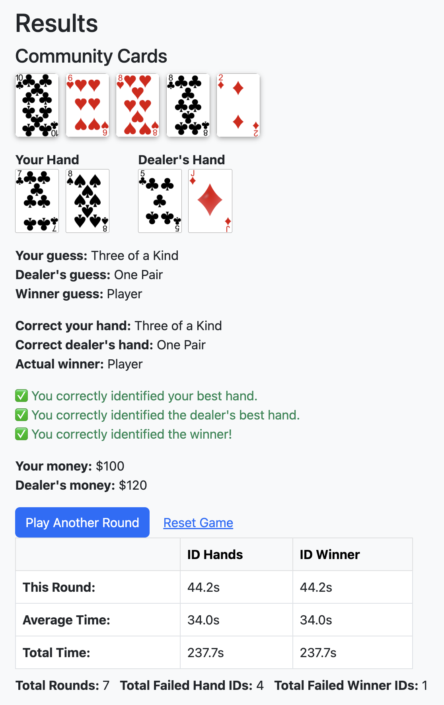

# Browser Version of Practice Game

This is a simple Flask web version of the Texas Hold'em Quiz Game.

- All game logic is in app.py
- HTML templates are in the templates/ folder.
- No betting rounds, just hand and winner identification practice.

You can reset the game at any time using the Reset button.

## Installing Flask and Libraries

cd web_practice && pip install -r requirements.txt

## Launching the Game

cd web_practice && python3 app.py

Then open http://127.0.0.1:5000/ in your browser

---
202506 - Frank Font (web version created 202309)
